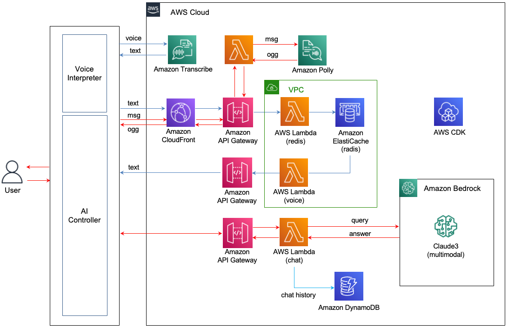

# 한국어 Voice-to-Voice 방식의 Voice Bot 만들기

여기서는 음성 텍스트 변환(Speech-to-Text), LLM(Large Language Model), 텍스트 음성 변환 (Text-to-Speech)를 통해 음성 챗봇 (voicebot)을 만드는것을 설명합니다. 전체적인 Architecture는 아래와 같습니다. 

1) 디바이스의 Voice Interpreter는 목소리에 대한 음성 스트림을 Transcrbie로 전송합니다.
2) Transcribe는 Partial/Full로 텍스트로 변환하여 전달합니다.
3) 텍스트를 브라우저에 있는 javascript로 만든 메시지앱이 사용하기 위하여 CloudFront - API Gateway - Lambda (redis)로 HTTP Post 방식으로 전달합니다. Lambda (redis)는 텍스트를 Amazon ElastiCache (Redis)에 publish합니다.
4) Lambda (voice)는 redis를 사용자 id로 subscribe하고 있다가 메시지가 네려오면 client로 전달합니다. Javacript로 된 메시지앱은 API Gateway와 Websocket으로 연결되어 있으므로 Redis를 통해 Lambda(voice)로 전달된 메시지는 즉시 client인 메시지앱으로 전달됩니다.
5) 메시지앱은 API Gateway - Lambda(chat)을 이용하여 LLM에 답변을 요청합니다.
6) 이때, 기존에 대화 이력이 없는 경우에는 DynamoDB에 이전 대화 이력이 있는지 확인하여 내부 메모리에 업데이트 합니다.
7) 대화이력을 포함한 Prompt가 LLM에 전달되어 적절한 응답을 얻습니다.
8) LLM의 답변은 CloudFront - API Gateway - Lambda (Polly)로 HTTP POST 방식으로 음성으로 변환을 요청합니다. Polly에서는 ogg형태의 음성 바이너리를 응답(200 OK)로 전달하면 브라우저에서 재생합니다.



## Speech-to-Text (Voice Interpreter)

Voice Interpreter는 [Amazon Transcribe Streaming SDK](https://github.com/awslabs/amazon-transcribe-streaming-sdk)을 참조하여 음성으로부터 Text를 추출합니다. 아래에서 설명하는 [Python 파일](./interpreter/mic_main.py)은 Device에 설치되고 실행됩니다. 만약 Device가 IoT라면 Greengrass의 Component로 배포될 수 있습니다. 이를 이용해 Device는 사용자의 음성에서 텍스트를 추출하여 생성형 AI를 이용한 Application에서 활용할 수 있습니다. [sounddevice](https://pypi.org/project/sounddevice/)를 이용해 아래와 같이 audio stream에서 음성 데이터를 추출합니다. 

```python
stream = sounddevice.RawInputStream(
  channels=1,
  samplerate=16000,
  callback=callback,
  blocksize=1024 * 2,
  dtype="int16",
)

with stream:
  while True:
    indata, status = await input_queue.get()
    yield indata, status
```

아래와 같이 사용할 region을 지정한 TranscribeStreamingClient을 이용하여 아래와 같이 텍스트 stream을 가져옵니다. 이때 변환할 언어(language_code)와 sampling rate, encoding 방식을 지정합니다. 

```python
from amazon_transcribe.client import TranscribeStreamingClient

async def basic_transcribe():
    # Setup up our client with our chosen AWS region
    client = TranscribeStreamingClient(region="ap-northeast-2")

    # Start transcription to generate our async stream
    stream = await client.start_stream_transcription(
        language_code="ko-KR",
        media_sample_rate_hz=16000,
        media_encoding="pcm",
    )

    # Instantiate our handler and start processing events
    handler = MyEventHandler(stream.output_stream)
    await asyncio.gather(write_chunks(stream), handler.handle_events())
````

텍스트는 아래와 같이 handle_transcript_event()에서 수행합니다. 결과는 Stream 형태로 부분(partial) 결과 후에 전체 결과(full)를 얻을 수 있습니다. state를 proceeding/completed로 나누어서, requests를 이용하여 API 서버로 전달하면, 생성형 AI에서 활용할 수 있습니다. 
```python
async def handle_transcript_event(self, transcript_event: TranscriptEvent):
  results = transcript_event.transcript.results
                       
    for result in results:       
      if result.is_partial == False:
        for alt in result.alternatives:
          print('----> ', alt.transcript)
          msg = {
            "userId": userId,
            "query": alt.transcript,
            "state": "completed"
          }
          resp = requests.post(url, json=msg)
          print('resp: ', resp)
      else:
        for alt in result.alternatives:
          print(alt.transcript)    
          msg = {
            "userId": userId,
            "query": alt.transcript,
            "state": "proceeding"
          }
          resp = requests.post(url, json=msg)
```

## LLM

Bedrock의 LLM을 이용해 질문과 답변을 수행하고자 합니다. 여기서는 한국어 성능이 좋고, 속도가 가장 빠른 Claude3 Haiku를 사용하였습니다. 

```python
chat = BedrockChat(
    model_id = modelId,
    client = boto3_bedrock,
    streaming = True,
    callbacks = [StreamingStdOutCallbackHandler()],
    model_kwargs = parameters,
)
```

prompt는 아래와 같이 일반적인 대화를 가정하였습니다. 

```python
def general_conversation(chat, query):
    global time_for_inference, history_length, token_counter_history    
    time_for_inference = history_length = token_counter_history = 0
    
    system = (
        """<history> tag의 대화를 참조하여 다음의 입력에 대해 적절한 답변을 합니다. 빠른 대화를 위해 답변은 짧고 정확하게 핵심만 얘기합니다. 필요시 2문장으로 답변할 수 있으나 가능한 1문장으로 답변합니다.
        
        <history>
        {history}
        </history>
        """
    )   
    human = "{input}"
    
    prompt = ChatPromptTemplate.from_messages([("system", system), MessagesPlaceholder(variable_name="history"), ("human", human)])
    print('prompt: ', prompt)
    
    history = memory_chain.load_memory_variables({})["chat_history"]
    print('memory_chain: ', history)
                
    chain = prompt | chat    
    try: 
        isTyping()  
        stream = chain.invoke(
            {
                "history": history,
                "input": query,
            }
        )
        msg = readStreamMsg(stream.content)    
                            
        msg = stream.content
        print('msg: ', msg)
    except Exception:
        err_msg = traceback.format_exc()
        print('error message: ', err_msg)        
            
        sendErrorMessage(err_msg)    
        raise Exception ("Not able to request to LLM")
    
    return msg
```


## Text-to-Speech

[Lambda-polly](./lambda-polly/lambda_function.py)에서는 텍스트를 음성으로 변환합니다. 여기에서는 ssml형태로 보이스를 조정하고 LangCode를 지정한 후에 출력은 ogg 파일을 얻습니다. 이것을 파일로 저장하고 재생하면 지연시간이 늘어나기 때문에 아래와 같이 base64로 encoding후에 client로 전달합니다.

```python
response = polly_client.synthesize_speech(
    Text=ssml_text,
    TextType='ssml', # 'ssml'|'text'
    Engine='neural',  # 'standard'|'neural'
    LanguageCode=langCode, 
    OutputFormat='ogg_vorbis', # 'json'|'mp3'|'ogg_vorbis'|'pcm',
    VoiceId=voiceId
)

encoded_content = base64.b64encode(response['AudioStream'].read()).decode()
```

client는 [chat.html](./html/chat.html)와 같이 아래와 [onended](https://developer.mozilla.org/en-US/docs/Web/API/HTMLMediaElement/ended_event) 포함한 audio를 정의합니다. 

```html
<audio src="" onended=""></audio>
```

[chat.js](./html/chat.js)에서는 아래와 같이 '/speech' API를 이용해 base64로 encoding된 음성파일(ogg)를 가져와서 Hashmap인 audoData에 저장합니다.

```java
let audioData = new HashMap();
function loadAudio(requestId, text) {
    const uri = "speech";
    const xhr = new XMLHttpRequest();

    let voiceId = 'Seoyeon';
    let langCode = 'ko-KR';  // ko-KR en-US(영어)) ja-JP(일본어)) cmn-CN(중국어)) sv-SE(스페인어))

    xhr.open("POST", uri, true);
    xhr.onreadystatechange = () => {
        if (xhr.readyState === 4 && xhr.status === 200) {
            response = JSON.parse(xhr.responseText);

            audioData[requestId+text] = response.body;

            console.log('successfully loaded. text= '+text);
        }
    };
    
    var requestObj = {
        "text": text,
        "voiceId": voiceId,
        "langCode": langCode
    }

    var blob = new Blob([JSON.stringify(requestObj)], {type: 'application/json'});

    xhr.send(blob);            
} 
```

LLM의 답변이 모두 온 후에 음성으로 변환하면 지연시간이 늘어나서 사용성이 나빠지므로, streaming으로 들어오는 text를 '.', '?', '!', ':' 기준으로 잘라서 라인형태로 재생합니다. 이때, 각 라인의 글자의 수가 다르므로 음성으로 encoding하는 시간이 다를 있습니다. 따라서, 아래와 같이 각 라인은 playList에 저장을 수행한 후에 loadAudio()로 음성으로 변환한 후에 audoData를 순차적으로 재생합니다. 

```java
lineText += response.msg;
lineText = lineText.replace('\n', '');
if (lineText.length > 3 && (response.msg == '.' || response.msg == '?' || response.msg == '!' || response.msg == ':')) {
    console.log('lineText: ', lineText);
    text = lineText
    playList.push({
        'played': false,
        'requestId': requestId,
        'text': text
    });
    lineText = "";

    loadAudio(response.request_id, text);
}
```

이후 playAudioList()를 이용해 재생을 하게 됩니다. 음성 재생을 순차적으로 하기 위하여 각 라인의 음성을 재생(play)할 때에는 next를 false로 지정하여 play를 지연시킵니다. 하나의 라인에 대한 재생이 완료되면 아래와 같이 next를 true로 변경하여 다음 라인에 대한 음성을 재생합니다. 또한, 이때에 라인의 글자 수가 많아서 아직 음성으로 변환이 되기 전이라면 음성 변환이 완료될 때 까지 기다렸다가 순차적으로 재생하여야 합니다. 

```java
function playAudioList() {
    for(let i=0; i<playList.length;i++) {
        if(next == true && playList[i].played == false && requestId == playList[i].requestId && audioData[requestId+playList[i].text]) {
            current = i;
            playAudioLine(audioData[requestId+playList[i].text]);            
            next = false;
            break;
        }
        else if(requestId != playList[i].requestId) {
            playList[i].played = true;
        }
    }
}
```

playAudioLine()는 하나의 라인에 대한 음성 변환을 수행합니다. audioData에 저장되었던 음성파일을 로드한 후에 playAudio()를 이용해 재생을 수행합니다. 재생완료를 알기 위하여 [onended](https://developer.mozilla.org/en-US/docs/Web/API/HTMLMediaElement/ended_event)을 이용합니다. 
```java
async function playAudioLine(audio_body){    
    var sound = "data:audio/ogg;base64,"+audio_body;
    
    var audio = document.querySelector('audio');
    audio.src = sound;
    
    console.log('play audio');
    await playAudio(audio)
}

// audio play
var audio = document.querySelector('audio');
audio.addEventListener("ended", function() {
    console.log("finish audio, text= ", playList[current].text)
    delay(1000)

    next = true;
    playList[current].played = true;
    audioData.remove([requestId+playList[current].text]);

    playAudioList()
});

function playAudio(audio) {
    return new Promise(res=>{
        audio.play()
        audio.onended = res
    })
}
```


## 직접 실습 해보기

### 사전 준비 사항

이 솔루션을 사용하기 위해서는 사전에 아래와 같은 준비가 되어야 합니다.

- [AWS Account 생성](https://repost.aws/ko/knowledge-center/create-and-activate-aws-account)에 따라 계정을 준비합니다.

### CDK를 이용한 인프라 설치

본 실습에서는 Seoul 리전 (ap-northeast-2)을 사용합니다. [인프라 설치](./deployment.md)에 따라 CDK로 인프라 설치를 진행합니다. [CDK 구현 코드](./cdk-voicebot/README.md)에서는 Typescript로 인프라를 정의하는 방법에 대해 상세히 설명하고 있습니다. 

## 실행결과

interpreter를 실행하면 아래와 같이 Stream으로 전달된 음성이 텍스트로 전환됨을 알 수 있습니다. 처음에 "너의 일이"로 인식되었다가 뒷 문장을 인식해서 "너의 이름은 무엇이니"로 변경되었음을 확인할 수 있습니다. 


이때, 채팅화면에 표시되는 입/출력은 아래와 같습니다. 마이크로 인식한 음성을 인식했고, LLM이 적절한 답변을 생성하였습니다. 화면에 표시되지 않지만, 실행시 브라우저를 통해 답변을 음성으로 들을 수 있습니다. 


## 리소스 정리하기 

더이상 인프라를 사용하지 않는 경우에 아래처럼 모든 리소스를 삭제할 수 있습니다. 

1) [API Gateway Console](https://ap-northeast-2.console.aws.amazon.com/apigateway/main/apis?region=ap-northeast-2)로 접속하여 "rest-api-for-llm-voicebot", "voice-ws-api-for-llm-voicebot", "ws-api-for-llm-voicebot"을 삭제합니다.

2) [Cloud9 Console](https://ap-northeast-2.console.aws.amazon.com/cloud9control/home?region=ap-northeast-2#/)에 접속하여 아래의 명령어로 전체 삭제를 합니다.


```text
cd ~/environment/llm-voicebot/cdk-voicebot/ && cdk destroy --all
```


## 결론

LLM으로 한국어 Voice-to-Voice 방식의 voice bot을 구현하여씃ㅂ니다. 한국 Voice 인식에 오류가 있더라도 LLM이 기능적으로 동일하게 처리할수 있어서 전체적인 인식능력의 향상을 기대할 수 있습니다. 또한 LLM에서 사용성을 위해 Stream을 사용하듯이 STT/TTS에서도 Stream을 사용하면 사용성이 개선됩니다. 
