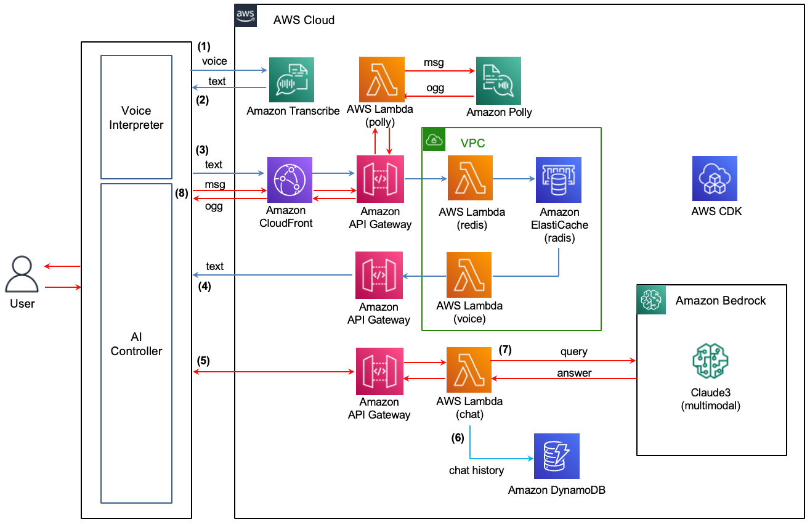

# 음성 챗봇 만들기

여기서는 음성 텍스트 변환(Speech-to-Text), LLM(Large Language Model), 텍스트 음성 변환 (Text-to-Speech)를 통해 음섬 챗봇 (voicebot)을 만드는것을 설명합니다.



## Speech-to-Text (Voice Interpreter)

Voice Interpreter는 [Amazon Transcribe Streaming SDK](https://github.com/awslabs/amazon-transcribe-streaming-sdk)을 참조하여 음성으로부터 Text를 추출합니다. 아래에서 설명하는 [Python 파일](./interpreter/mic_main.py)은 [Greengrass V2](https://docs.aws.amazon.com/greengrass/v2/developerguide/develop-greengrass-components.html)의 Local component를 이용해 Device에 설치되고 실행됩니다. 이를 이용해 Device는 사용자의 음성에서 텍스트를 추출하여 생성형 AI를 이용한 Application에서 활용할 수 있습니다. [sounddevice](https://pypi.org/project/sounddevice/)를 이용해 아래와 같이 audio stream에서 음성 데이터를 추출합니다.

```python
stream = sounddevice.RawInputStream(
  channels=1,
  samplerate=16000,
  callback=callback,
  blocksize=1024 * 2,
  dtype="int16",
)

with stream:
  while True:
    indata, status = await input_queue.get()
    yield indata, status
```

아래와 같이 사용할 region을 지정한 TranscribeStreamingClient을 이용하여 아래와 같이 텍스트 stream을 가져옵니다. 이때 변환할 언어(language_code)와 sampling rate, encoding 방식을 지정합니다. 

```python
from amazon_transcribe.client import TranscribeStreamingClient

async def basic_transcribe():
    # Setup up our client with our chosen AWS region
    client = TranscribeStreamingClient(region="ap-northeast-2")

    # Start transcription to generate our async stream
    stream = await client.start_stream_transcription(
        language_code="ko-KR",
        media_sample_rate_hz=16000,
        media_encoding="pcm",
    )

    # Instantiate our handler and start processing events
    handler = MyEventHandler(stream.output_stream)
    await asyncio.gather(write_chunks(stream), handler.handle_events())
````

텍스트는 아래와 같이 handle_transcript_event()에서 수행합니다. 결과는 partial 결과 후에 전체 결과를 얻을 수 있습니다. 이 데이터를 requests를 이용하여 특정 API 서버로 전달하면, 추후 생성형 AI에서 활용할 수 있습니다. 
```python
async def handle_transcript_event(self, transcript_event: TranscriptEvent):
  results = transcript_event.transcript.results
                       
    for result in results:       
      if result.is_partial == False:
        for alt in result.alternatives:
          print('----> ', alt.transcript)
          #msg = {
            "userId": userId,
            "query": alt.transcript,
            "state": "completed"
          }
          resp = requests.post(url, json=msg)
          print('resp: ', resp)
      else:
        for alt in result.alternatives:
          print(alt.transcript)    
          msg = {
            "userId": userId,
            "query": alt.transcript,
            "state": "proceeding"
          }
          resp = requests.post(url, json=msg)
```

## LLM

## Text-to-Speech

Amazon Polly를 이용해 텍스트를 음성으로 변환합니다. 이때 시간지연이 없도록 파일이 아닌 음성데이터를 이용하여 변환 및 음성 송출을 수행합니다. 
